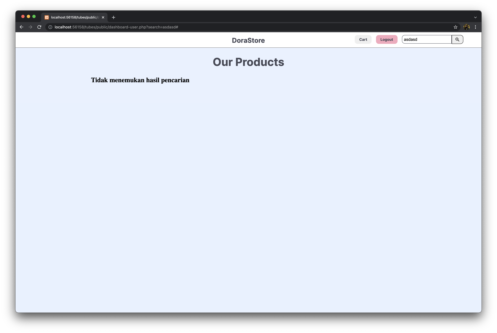

# Tugas Besar 2 - Web Services Using SOAP and REST
Dorayaki Store 
IF3110 - Pengembangan Perangkat Lunak Berbasis Web

## Author
- Shifa Salsabiila (13519106)
- Ryo Richardo (13519193)
- Andres Jerriel Sinabutar (13519218)

## 1. Penjelasan Singkat
DoraStore merupakan sebuah perangkat lunak berbasis web yang dirancang sebagai platform jual beli Dorayaki. DoraStore memiliki fungsionalitas untuk dua jenis role, yaitu user dan admin. Secara umum, DoraStore memiliki  fitur autentikasi pengguna, pengelolaan varian dorayaki (bagi admin), manajemen stok dorayaki, melihat varian dorayaki, serta pembelian dorayaki. Perangkat lunak ini dibangun menggunakan beberapa ketentuan berikut:
1. Client side: HTML, CSS, JavaScript (tanpa framework)
2. Server side: PHP murni
3. Database: SQLite

## 2. Requirements
1. PHP 8.0.11
2. HTML5
3. CSS
4. SQLite 3.36.0
5. XAMPP 8.0 ke atas

## 3. Cara Instalasi
1. Clone/Download repository ini
2. Masukkan folder repository ke dalalm folder htdocs XAMPP* [Tutorial XAMPP](https://www.edureka.co/blog/how-to-run-a-php-program-in-xampp/)
3. Jalankan server (Lihat poin 4)
*optional: untuk MacOS dan Linux

## 4. Cara Menjalankan Server 
1. Cara menjalankan server berbeda untuk platform yang berbeda, untuk mengetahui detail cara menjalankan server pada platform Anda, silakan cek dokumentasi berikut:
* Windows: [Tutorial Server Windows](https://www.apachefriends.org/faq_windows.html)
* MacOS: [Tutorial Server MacOS](https://www.apachefriends.org/faq_osx.html#:~:text=To%20start%20XAMPP%20simply%20open,is%20%22manager%2Dosx%22)
* Linux:  [Tutorial Server Linux](https://www.apachefriends.org/faq_linux.html)
2. Setelah menjalankan server, navigasi ke file /app/db/dorastore.sqlite3, berikan *read and write permission* kepada XAMPP untuk menulis *database*.
3. Setelah itu, navigasi ke folder /public/img/, lakukan hal yang sama terhadap folder /img.
4. Kemudian, navigasi ke folder /app/db/migrations, jalankan seluruh file php di dalamnya untuk *create* tabel-tabel yang diperlukan ke dalam basisdata.
5. Kemudian, navigasi ke folder /app/db/seeders, jalankan seluruh file php di dalamnya untuk mengisi tabel-tabel yang diperlukan dengan data-data awal.

## 5. Screenshot Layar
### 5.1. Halaman Login
#### *Screen Capture*

### 5.2. Halaman Register
#### *Screen Capture*

### 5.3. Halaman Dashboard
#### *Screen Capture*

### 5.4. Halaman Hasil Pencarian
#### *Screen Capture*

### 5.5. Halaman Penambahan Varian Dorayaki Baru
#### *Screen Capture*

### 5.6. Halaman Detail Varian Dorayaki
#### *Screen Capture*

### 5.7. Halaman Pengubahan Stok / Pengubahan Detail Dorayaki
#### *Screen Capture*

### 5.8. Halaman Pembelian Dorayaki
#### *Screen Capture*

## 6. Pembagian Tugas
**Server-side**
| Fitur  | 13519106 | 13519193 | 13519218 |
| --- | --- | --- | --- |
| Login |  | :white_check_mark: | :white_check_mark: |
| Register   |  |  | :white_check_mark: |
| Dashboard   |  | :white_check_mark: | :white_check_mark: |
| Hasil Pencarian   |  |  | :white_check_mark: |
| Penambahan Varian Dorayaki Baru  | :white_check_mark: |  |  |
| Penghapusan Dorayaki  | :white_check_mark: |  | :white_check_mark: |
| Detail Varian Dorayaki  |  |  | :white_check_mark: |
| Pengubahan Detail Dorayaki  |  |  | :white_check_mark: |
| Pembelian Dorayaki  | :white_check_mark: |  | :white_check_mark: |
| Database  |  |  | :white_check_mark: |

**Client-side**
| Fitur  | 13519106 | 13519193 | 13519218 |
| --- | --- | --- | --- |
| Login | :white_check_mark: | :white_check_mark: |  |
| Register   | :white_check_mark: | :white_check_mark: |  |
| Dashboard   |  | :white_check_mark: |  |
| Hasil Pencarian   |  | :white_check_mark: |  |
| Penambahan Varian Dorayaki Baru  | :white_check_mark: | :white_check_mark: |  |
| Penghapusan Dorayaki  | :white_check_mark: | :white_check_mark: |  |
| Detail Varian Dorayaki  | :white_check_mark: |  | :white_check_mark: |
| Pengubahan Detail Dorayaki  | :white_check_mark: | :white_check_mark: |  |
| Pembelian Dorayaki  | :white_check_mark: | :white_check_mark: | :white_check_mark: |

## 7. Credential First Users
1. User 
username: user 
password: user

2. Admin 
username: admin 
password: admin
